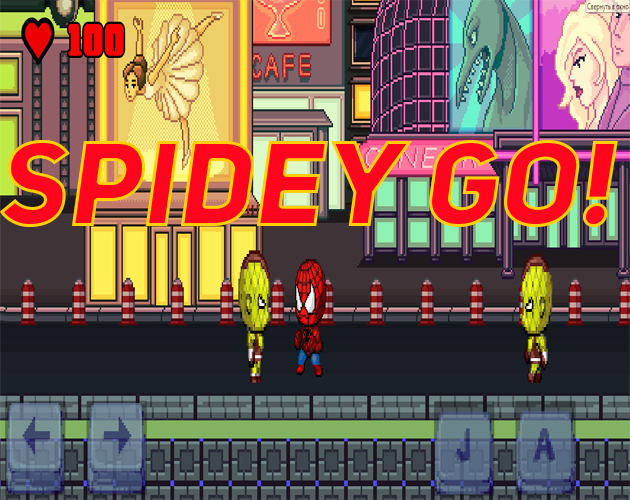
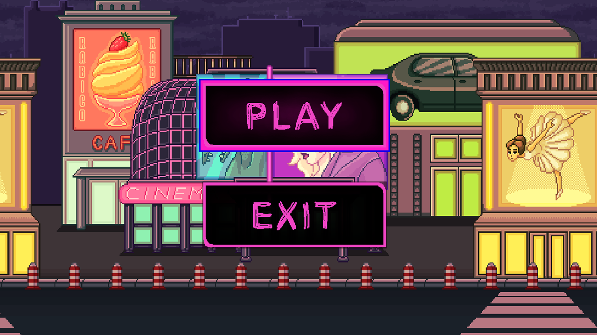
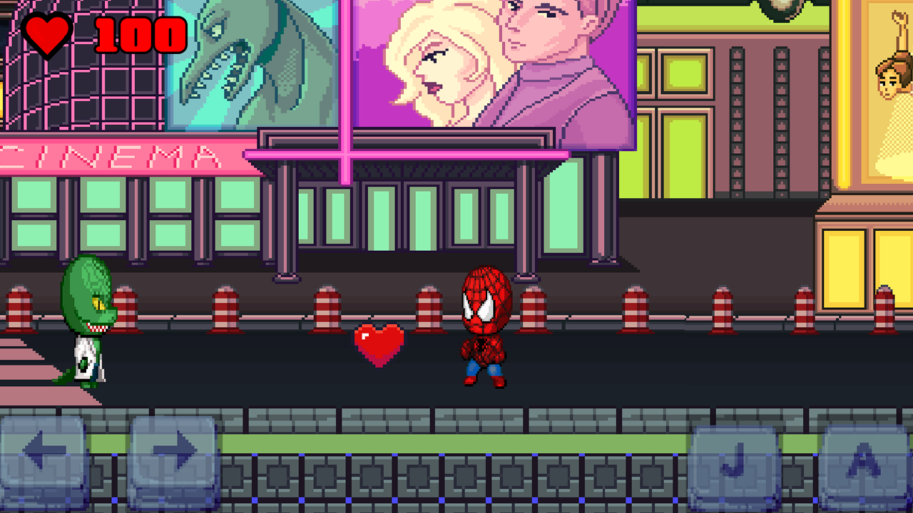
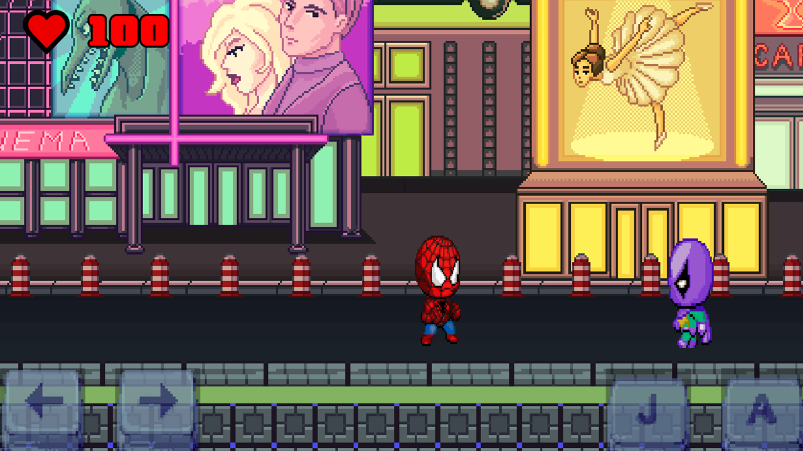

# 🕷️ Spidey GO!



---

## 🇰🇿 Қазақша

**Spidey GO!** — чиби стильдегі пиксельдік 2D экшн ойын. Сен Spider-Man ретінде қалада жүресің, дұшпандарды паутинамен немесе басына секіру арқылы жеңесің және аман қалуға тырысасың. Ойын менің қызым үшін жасалды! 🩷

### ⚙️ Ойын мүмкіндіктері
- 🕷️ Паутинамен атқылау
- 👟 Дұшпан басына секіру арқылы өлтіру
- ❤️ Жүректерді жинап өмірді қалпына келтіру
- 👾 5 түрлі дұшпан: Rhino, Scorpion, Shocker, The Lizard, Powler
- 🌆 Бесконечная дұшпан пайда болу
- 📱 Мобильді басқару (экрандағы батырмалар)

### 🎮 Басқару
| Батырма | Әрекет |
|--------|--------|
| `← →` | Жүру |
| `J` | Секіру |
| `A` | Паутина атқылау |

### 🚀 Іске қосу
1. [Godot Engine 4](https://godotengine.org/) орнатыңыз
2. Жобаны клондаңыз:
```bash
git clone https://github.com/segamania90-crypto/spidey-go.git
```
3. `project.godot` файлын ашыңыз
4. ▶️ Run (F5) басыңыз

---

## 🇷🇺 Русский

**Spidey GO!** — пиксельный 2D экшн в стиле чиби. Играй за Spider-Man в ночном городе — стреляй паутиной, прыгай на врагов и выживай как можно дольше. Игра была сделана для моей дочери! 🩷

### ⚙️ Особенности
- 🕷️ Стрельба паутиной
- 👟 Убийство врагов прыжком на голову
- ❤️ Подбирай сердечки для восстановления HP
- 👾 5 видов врагов: Rhino, Scorpion, Shocker, The Lizard, Powler
- 🌆 Бесконечный спавн врагов
- 📱 Мобильное управление (кнопки на экране)

### 🎮 Управление
| Клавиша | Действие |
|---------|----------|
| `← →` | Движение |
| `J` | Прыжок |
| `A` | Паутина |

### 🚀 Запуск
1. Установи [Godot Engine 4](https://godotengine.org/)
2. Клонируй репозиторий:
```bash
git clone https://github.com/segamania90-crypto/spidey-go.git
```
3. Открой `project.godot` в Godot
4. Нажми ▶️ Run (F5)

---

## 🇬🇧 English

**Spidey GO!** is a chibi-style pixel 2D action game. Play as Spider-Man in a neon city — shoot webs, stomp enemies, and survive as long as you can. This game was made for my daughter! 🩷

### ⚙️ Features
- 🕷️ Web shooting attack
- 👟 Stomp enemies by jumping on their heads
- ❤️ Collect hearts to restore HP
- 👾 5 enemy types: Rhino, Scorpion, Shocker, The Lizard, Powler
- 🌆 Endless enemy spawning
- 📱 Mobile controls (on-screen buttons)

### 🎮 Controls
| Key | Action |
|-----|--------|
| `← →` | Move |
| `J` | Jump |
| `A` | Shoot web |

### 🚀 How to Run
1. Install [Godot Engine 4](https://godotengine.org/)
2. Clone the repository:
```bash
git clone https://github.com/segamania90-crypto/spidey-go.git
```
3. Open `project.godot` in Godot
4. Press ▶️ Run (F5)

---

## 📁 Project Structure

```
├── spider_man/
│   ├── spider_man.gd    # Player movement, web attack, health
│   └── web.gd           # Web projectile
├── enemies/
│   ├── rhino.gd         # Rhino enemy
│   ├── scorpion.gd      # Scorpion enemy
│   ├── shocker.gd       # Shocker enemy
│   ├── the_lizard.gd    # Lizard enemy
│   └── powler.gd        # Powler enemy
├── items/
│   └── heart.gd         # Heart pickup
├── hud/
│   └── hud.gd           # On-screen UI and mobile buttons
├── main_level.gd        # Level logic, enemy spawning
└── project.godot
```

## 🛠️ Built With
- [Godot Engine 4](https://godotengine.org/) — GDScript
- Chibi pixel art style

## 📸 Screenshots

| Menu | Gameplay | Combat |
|------|----------|--------|
|  |  |  |
